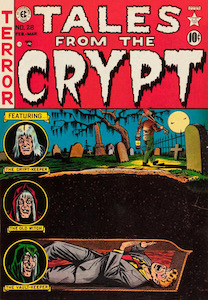



# Participation

Your participation grade is based on active participation in online and in-class discussions. The online and in-class components will each count for 1/2 of your total participation grade.

## Online Participation

- Post a response to the online discussion and comment on the responses of two or more students for an A or A-
- Post a response to the online discussion and comment on the response of one other student for a B+, B, or B-
- Post a response to the online discussion or comment on other student responses, but not both, for a C+, C, or C-
- 
