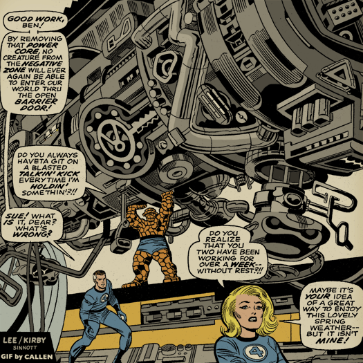



# Z672/Z604 Comics Studies Resources

Below are sample resources related to comics and fandom studies. The list is not exhaustive and is meant as an illustrative guide to the many sorts of print and online resources available for librarians, teachers, scholars, and fans.

_Gif by [Callen](https://kerrycallen.blogspot.com/2012/10/animated-kirby-machinery.html)._

## Contents
- [General](#general)
- [Histories](#histories)
- [Academic](#academic)
- [Professional Societies and Organizations](#professional-societies-and-organizations)
- [Journals](#journals)
- [News](#news)
- [Conferences](#conferences)
- [Bibliographies](#bibliographies)
- [Digital Comics Collections](#digital-comics-collections)
- [Digital Comics Readers](#digital-comics-readers)
- [Archive and Library Supplies](#archive-and-library-supplies)
- [Creators](#creators)
- [Library Research Guides And Readers Advisories](#library-research-guides-and-readers-advisories)
- [Publishers](#publishers)
- [Museums and Archives](#museums-and-archives)
- [Auction Houses](#auction-houses)
- [Digital Comics Formats](#digital-comics-formats)
- [Data Sets](#data-sets)
- [Text Analysis Tools](#text-analysis-tools)
- [Visualization Tools](#visualization-tools)

## General
* [Avengers, Assembled][1]
* [Broken Pencil][36]
* [Comic Cartography][3]
* [Comichron][4]
- [inkt&#x01C0;art](https://inktart.org)
* [No Flying No Tights][5]
* [The Complete Marvel Reading Order][6] (CMRO)
* [The Grand Comic Book Database][7] (GCD)
* [The Periodic Table of Comic Books](http://www.uky.edu/Projects/Chemcomics/)
* [Who's Who of American Comic Books 1928-1999][9]
* [Women in Refrigerators][10]
* [World of Black Heroes][11]
* Gerber, Ernst and Mary Gerber. _The Photo Journal Guide to Comic Books_. 2 vols. Minden, NV: Gerber Publishing Company, 1989-1990.
* Gerber, Ernst. _The Photo Journal Guide to Marvel Comics_. 2 vols. Minden, NV: Gerber Publishing Company, 1991. _Note: Volumes are numbered 3 and 4, continuing numbering from the Ernst’s_ The Photo Journal Guide to Comic Books _, above_.
* Robins, Scott and Snow Wildsmith. _A Parent's Guide to the Best Kids' Comics: Choosing Titles Your Children Will Love_. Iola, WI: Krause, 2012.
* Steinhauer, Jillian. [“A Compendium of Comic Maps”][12]. [_Hyperallergic_][13], April 16, 2014. 
* Overstreet, Robert M. _Overstreet Comic Book Price Guide_. See <https://www.gemstonepub.com/>

## Histories
* Dallas, Keith. _American Comic Book Chronicles: The 1980s 1980-1989_. Raleigh, NC: TwoMorrows, 2013.
* Levitz, Paul. _75 Years of DC Comics: The Art of Modern Mythmaking_. Hohenzollernring: Taschen, 2010.
* Sabin, Roger. _Comixs, Comix, & Graphic Novels: A History of Comic Art_. London: Phaidon, 1996.
* Sacks, Jason. _American Comic Book Chronicles: The 1970s 1970-1979_. Raleigh, NC: TwoMorrows, 2014.
* Schelley, Bill. _American Comic Book Chronicles: The 1950s 1950-1969_. Raleigh, NC: TwoMorrows, 2013.
* Spiegelman, Art and Françoise Mouly. _The Toon Treasury of Classic Children's Comics_. New York: Abrams, 2009.
* Thomas, Roy. _75 Years of Marvel Comics: From the Golden Age to the Silver Screen_. Hohenzollernring: Taschen, 2014.  
* Wells, John. _American Comic Book Chronicles: The 1960s 1960-1964_. Raleigh, NC: TwoMorrows, 2012.
* Wells, John. _American Comic Book Chronicles: The 1960s 1965-1969_. Raleigh, NC: TwoMorrows, 2014.

## Academic
* [Comic Art in Scholarly Writing: A Citation Guide][15]
* [Comic Book Markup Language][16] (CBML)
* [Comix-Scholars Discussion List](https://comics.english.ufl.edu/comic-scholars-discussion-list/)
* [What Were Comics?][19]

## Professional Societies and Organizations
* [Comic Book Legal Defense Fund][20]
* [Comics Studies Society][21]
* [Popular Culture Association][22]
* Indiana University’s student-run [Comic Book Book Club](https://beinvolved.indiana.edu/organization/comicbooks)

## Journals and Magazines
* [Journal of Graphic Novels and Comics][23]  
* [_Inks: The Journal of the Comics Studies Society_][24]
* [_The Comics Grid: Journal of Comics Scholarship_][25]
* [_The Comics Journal_][26]
* [_Hogan’s Alley: The Magazine of the Cartoon Arts](https://www.hoganmag.com)
* [_ImageText_](https://imagetextjournal.com)
* [_Studies in Comics_][28]
* [_European Comic Art_](https://www.berghahnjournals.com/view/journals/eca/eca-overview.xml)
* [_Journal of Popular Culture_][31]
* [_Image \[&\] Narrative_][32]
* [_Sane journal: Sequential Art Narrative in Education_][33]
* [_Journal of Comics and Culture_][34]
* See also the Fan Studies Network’s list of [Fan Studies Journals][35]

## News
* [Comic Book Resources][38]
* [Comic Vine][39]
* [Comics Book Daily][40]
* [The Beat][41]
* [The Comics Reporter][42]

## Conferences
* [Comics Studies Society Annual Conference](https://comicsstudies.org/)
* [Comics Arts Conference][44]
* [Popular Culture Association](https://pcaaca.org/page/nationalconference)
* [Fan Studies Network][46] (UK)
* [Fan Studies Network North America][47]

## Bibliographies
* [Comics Research Bibliography][48]
* [Bonner Online-Bibliographie zur Comicforschung](https://www.bobc.uni-bonn.de/)
		 
## Digital Comics Collections
* [Comic Book +](https://comicbookplus.com)
* [Digital Comic Museum](http://digitalcomicmuseum.com/) (DCM)
* [Internet Archive](http://archive.org)
* [kwakk.info](https://kwakk.info) (“comics magazine [fanzine] search engine”)

## Digital Comics Readers
* [Simple Comic](https://github.com/MaddTheSane/Simple-Comic/) (GitHub site)
	* [Simple Comic](https://apps.apple.com/us/app/simple-comic/id1497435571) (Mac App Store) 
	* [Simple Comic](
* [OpenComic](https://github.com/ollm/OpenComic)

## Archive and Library Supplies
* [E. Gerber][52]

## Youth
* [The Comic Book Project][53]

## Creators
* [Jack Bradbury](https://jbrad.org)
* [Guy Delisle][55]
* [Lucy Knisley][56]
* [G. Willow Wilson][54]
* [Gene Luen Yang](https://geneyang.com)

## Publishers
* [Boom! Studios][57]
* [Dark Horse][58]
* [DC][59]
* [Drawn and Quarterly][60]
* [Fantagraphics][61]
* [IDW][62]
* [Image][63]
* [Marvel][64]
* [Toon Books][65]
* [TwoMorrows][66]

## Library research guides and readers advisories
* [A Readers Advisory Guide Autobiographical Graphic Novels][67]
* [Graphic Novels and Comics][69]

## Museums and archives
* [American Heritage Center, University of Wyoming][70]
* [Billy Ireland Cartoon Library and Museum, Ohio State University][71]
* [Comic Art Collection, Michigan State University][72]
* [Comic Art Collection, University of Missouri][73]
* [Comic Arts Collection, Virginia Commonwealth University][74]
* [Jack Kirby Museum & Research Center][75]
* [Ray & Pat Browne Library For Popular Culture Studies, Bowling Green State University][76]
* [University of Iowa Special Collections][77] 

## Auction houses
* [Heritage Auctions](https://comics.ha.com/)

## Digital Comics Formats
* [Comic Book Archive][7
* [Comic Book Markup Language][80]

## Data Sets and Databases
* [Carl Barks](https://www.cbarks.dk)
* [Kees Kousemaker'S Comiclopedia](https://www.lambiek.net/comiclopedia/artist-compendium.html)
* [eBDtheque: a representative database of comics](https://ebdtheque.univ-lr.fr/registration/)
* Grand Comics Database. See <https://docs.comics.org/wiki/Data_Distribution>
* [I.N.D.U.C.K.S.: The Disney Comics Database](https://inducks.org/index.php)
* [Manga 109: Japanese Manga Dataset](http://www.manga109.org/en/)
* [The Marvel Universe Social Network Dataset][85] from [Kaggle][86]
	* This dataset only provides connections among the superheroes in Marvel Universe, villains are omitted.
* [The Marvel and DC Characters Dataset][87] from [Kaggle][88]
* Michigan State University Libraries [Comics as Data: North America][84]
* [The Stephen Cooper Comic Book Collection][81]
	* Omeka collections with links to data-driven [student projects][82] and related [data set][83] about the collection.
* [Don Markstein’s Toonopedia](https://www.toonopedia.com)
* [More…](https://iapr-tc10.univ-lr.fr/?page_id=71#comic-book-datasets)

## Text Analysis Tools
* [Voyant][89]
* [AntConc][90]

## Visualization Tools
* [Flourish][91]
* [Tableau][92]

[1]: https://www.jerthorp.com/avengersassembled
[3]: https://comiccartography.tumblr.com/
[4]: http://comichron.com/
[5]: http://noflyingnotights.com
[6]: http://cmro.travis-starnes.com/
[7]: https://comics.org
[9]: http://www.bailsprojects.com/whoswho.aspx
[10]: http://lby3.com/wir/
[11]: http://worldofblackheroes.com
[12]: https://hyperallergic.com/121005/a-compendium-of-comic-maps/
[13]: https://hyperallergic.com
[15]: http://comicsresearch.org/CAC/cite.html
[16]: http://cbml.org
[17]: http://dissimilitudes.lip6.fr:8182/#/
[19]: https://www.whatwerecomics.com
[20]: http://cbldf.org
[21]: http://www.comicsstudies.org/
[22]: https://pcaaca.org
[23]: https://www.tandfonline.com/toc/rcom20/current
[24]: https://ohiostatepress.org/Inks.html
[25]: https://www.comicsgrid.com/
[26]: http://www.tcj.com/author/ryan-holmberg/
[28]: https://www.intellectbooks.co.uk/journals/view-Journal,id=168/
[31]: https://www.journalofpopularculture.com
[32]: http://ojs.arts.kuleuven.be/index.php/imagenarrative/index
[33]: https://digitalcommons.unl.edu/sane/
[34]: https://press.pace.edu/the-journal-of-comics-and-culture/
[35]: https://fanstudies.org/fan-studies-journals/
[36]: https://brokenpencil.com/
[37]: https://inktart.org
[38]: http://cbr.com
[39]: https://comicvine.gamespot.com/
[40]: http://www.comicbookdaily.com
[41]: http://www.comicsbeat.com/
[42]: http://comicsreporter.com
[44]: https://comicsartsconference.wp.txstate.edu/

[46]: https://fanstudies.org
[47]: https://fsn-northamerica.org
[48]: https://www.facebook.com/comicsresearchbibliography
[50]: http://digitalcomicmuseum.com/
[51]: https://comicbookplus.com
[52]: https://www.egerber.com
[53]: http://www.comicbookproject.org
[54]: http://gwillowwilson.com
[55]: http://www.guydelisle.com
[56]: http://www.lucyknisley.com
[57]: http://www.boom-studios.com
[58]: https://www.darkhorse.com
[59]: http://www.dccomics.com
[60]: https://www.drawnandquarterly.com
[61]: http://www.fantagraphics.com
[62]: http://www.idwpublishing.com
[63]: https://imagecomics.com
[64]: http://marvel.com
[65]: http://www.toon-books.com/
[66]: http://twomorrows.com
[67]: http://mkersulo.wix.com/autocomics
[69]: https://guides.nyu.edu/graphic-novels/journals
[70]: http://www.uwyo.edu/ahc/collections/by-subject/comics.html
[71]: http://cartoons.osu.edu
[72]: http://comics.lib.msu.edu
[73]: https://library.missouri.edu/specialcollections/collections/show/4
[74]: https://www.library.vcu.edu/research-teaching/special-collections-and-archives/collections/comic-arts/
[75]: http://www.kirbymuseum.org/
[76]: https://www.bgsu.edu/library/pcl.html
[77]: http://www.lib.uiowa.edu/sc/resources/comicbookcollections/
[79]: https://en.wikipedia.org/wiki/Comic_book_archive
[80]: http://cbml.org
[81]: https://cary-exhibits.rit.edu/exhibits/show/cooper-comics
[82]: https://cary-exhibits.rit.edu/exhibits/show/cooper-comics/student-work
[83]: https://mikrowelle.github.io/cooper-comics-final/data/Cooper%20Comics%20Reprint%20Metadata.xlsx
[84]: https://github.com/ktopham/comics-as-data
[85]: https://www.kaggle.com/csanhueza/the-marvel-universe-social-network
[86]: https://www.kaggle.com/
[87]: https://www.kaggle.com/dannielr/marvel-superheroes#marvel_dc_characters.csv
[88]: https://www.kaggle.com/
[89]: https://voyant-tools.org
[90]: http://www.laurenceanthony.net/software.html
[91]: https://flourish.studio/
[92]: https://public.tableau.com/

<!--

Don Gilford’s Mad Cover Site: https://madcoversite.com/index.html
Comic Book Historians: https://comicbookhistorians.com/
International Catalogue of Superheroes: http://www.internationalhero.co.uk/
The Timely-Atlas Comics Blog: https://timely-atlas-comics.blogspot.com/
The Horrors of It All: https://thehorrorsofitall.blogspot.com/
Atlas Tales: https://www.atlastales.com/
Ace Horror: http://aces-of-ace.de/
Charm of Charlton Horror: http://charm-of-charlton.de/
Charlton Reading Library: https://charltonlibrary.blogspot.com/
The Big Blog of Kid’s Comics: http://www.bigblogcomics.com/

-->
