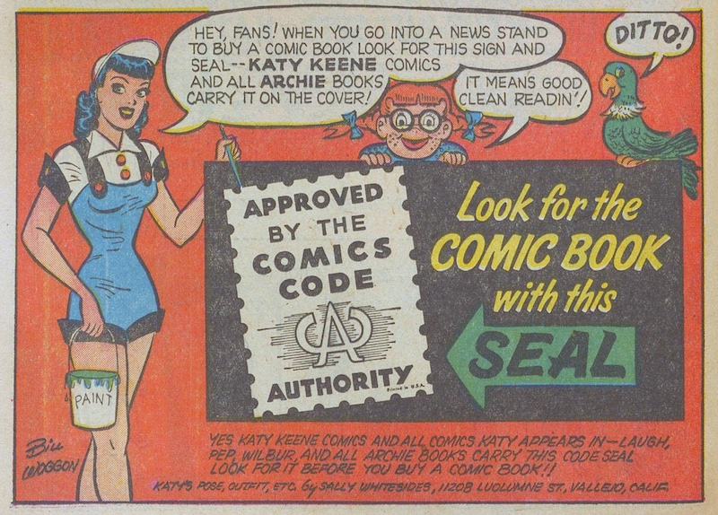


# General information

_Comics Code Authority announcement in_ Katy Keene Annual _#2 (Archie Comics, 1955-1956)_

## Course description<a id="desc"/>
In this seminar we will study the many ways in which readers and fans engage with comic books and comic book culture. This seminar is also a research methods course: we will survey and practice qualitative, quantitative, and digital methods for studying comic readers and fans. Modes of reader engagement include correspondence and communications through print fan mail columns and social media; cosplay; fanzine production; participation in fan clubs, comics-related contests, and comics conventions; blogs and podcasts; and more. We will survey several research methods for studying reader and fan engagement, including archival research, ethnography, and text data mining.

The course is relevant both to students wishing to develop programs and resources to engage readers and others more generally interested in comics and fandom studies.

Because we will be engaging with digital media and digital research methods, this course fulfills requirements for the ILS digital humanities specialization and the IU digital arts and humanities [Ph.D. minor and graduate certificate](https://idah.indiana.edu/training/certificate.html).

## Course goal
By the end of the course, students will be able to design and carry out a small-scale research project on comic readers and fans using at least one qualitative or digital method covered in class.

## Learning outcomes

By the end of this course, students will be able to:

1. **Explain key concepts in fan and reader studies** (e.g., participatory culture, acafandom, paratext, prosumption) and apply them to comic book cultures.
2. **Formulate researchable questions** about comic readers, fans, and fan practices (e.g., letter columns, conventions, fanzines, fan fiction, social media activity).
3. **Select and justify appropriate methods** (e.g., qualitative content analysis, ethnography, autoethnography, digital text analysis, visualization) for a given fan-related research question.
4. **Collect and document data** about reader and fan practices, both in print (archives, collections, fanzines, letters pages) and online (forums, social media, fanfiction platforms).
5. **Analyze fan-related texts and practices** using at least one qualitative method (e.g., content analysis, ethnography/autoethnography, reception/reader-response).
6. **Apply at least one digital/data-driven method** (e.g., text analysis, basic corpus building, coding/queries in NVivo, visualization in Excel/Tableau) to a comics/fandom dataset.
7. **Communicate findings and datasets** to academic and professional audiences through:
   - A **written hybrid research/data paper**, and
   - A **short video presentation** that explains methods, data, and findings.
8. **Reflect critically and ethically** on their own positionality as readers/fans and on issues of access, consent, and power in researching fan communities (especially online).

## About your instructor

Hello. My name is John. I use he/him/his pronouns, and you may call me John, Dr. Walsh, or Professor Walsh. I am an Associate Professor of Information and Library Science in the [Luddy School of Informatics, Computing, and Engineering](https://luddy.indiana.edu/)and Director of the [HathiTrust Research Center](https://pti.iu.edu/centers/htrc/). I received my Ph.D. in English literature (focusing on 19th-century British poetry) at IU. While earning my Ph.D. and after, I spent ten years as a technologist and librarian in IU’s Digital Library Program before joining the [Department of Information and Library Science](https://ils.indiana.edu/) in 2006. My research interests include: computational literary studies; textual studies and bibliography; text technologies; book history; 19th-century British literature, poetry and poetics; and comic books. Comics of course are the topic of this course.

I have been a comic book reader, collector, and fan since I was a young boy. As part of my research, I have developed the [Comic Book Markup Language](http://cbml.org/) (CBML), an XML vocabulary for the scholarly encoding of comics, graphic novels, and similar documents. More recently my interests have moved in the direction of readership and fan studies. I am a founding member of the [Comics Studies Society](https://comicssociety.org/) and regularly attend their annual conference and other comics studies conferences, workshops, and events. I like to spend time with my wife (a librarian!), four kids, and our dog Hugo.

I had a former life as a [rock and roll musician](https://open.spotify.com/album/03Ma8ivUgZaVCsmwqxNZuQ?si=SxkMag_lTxSarhtQbOfrYw), and I still play guitar, sing, write songs, and—very occasionally—perform.

## Texts
*   Most readings will be available online or provided as PDFs through canvas.
*   Many of comics we will read are available digitally on [comixology.com](http://comixology.com/).

## Grading
Late assignments will be accepted after the due date without a penalty on the grade only with the prior consent of the instructor. Assignments submitted late without the prior consent of the instructor will be docked the equivalent of half a letter grade for each day they are late. Missing a class without prior consent of the instructor may drop your final grade by a letter. Incompletes will be given for the course for medical reasons only.

## Sexual Harassment
As your instructor, one of my responsibilities is to create a positive learning environment for all students. Title IX and IU’s Sexual Misconduct Policy prohibit sexual misconduct in any form, including sexual harassment, sexual assault, stalking, and dating and domestic violence. If you have experienced sexual misconduct, or know someone who has, the University can help.

If you are seeking help and would like to speak to someone confidentially, you can make an appointment with:

The Sexual Assault Crisis Services (SACS) at (812) 855-8900 (counseling services) Confidential Victim Advocates (CVA) at (812) 856-2469 (advocacy and advice services) IU Health Center at (812) 855-4011 (health and medical services)
It is also important that you know that Title IX and University policy require me to share any information brought to my attention about potential sexual misconduct, with the campus Deputy Title IX Coordinator or IU’s Title IX Coordinator. In that event, those individuals will work to ensure that appropriate measures are taken and resources are made available. Protecting student privacy is of utmost concern, and information will only be shared with those that need to know to ensure the University can respond and assist.

I encourage you to visit <http://stopsexualviolence.iu.edu/index.html> to learn more.
