# Excel visualization walk-through
## Dataset
We're going to work with data for the Cooper Comics Collection. Download the dataset [here](https://mikrowelle.github.io/cooper-comics-final/data/Cooper%20Comics%20Reprint%20Metadata.xlsx)
## Filtering
Filtering lets you specify which data you want to see while you're looking at a spreadsheet.
1. When you've downloaded the dataset, open it in Excel.  
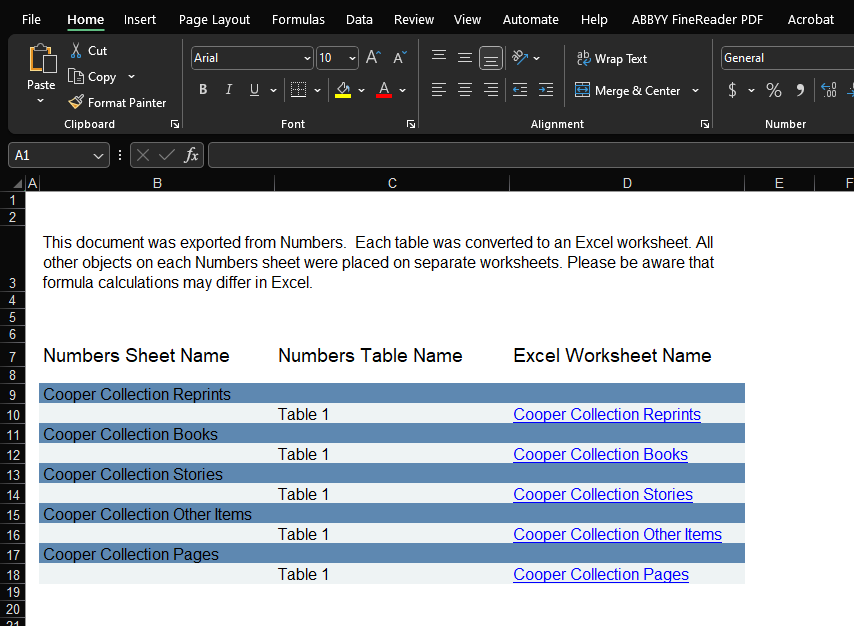
3. There are different tabs (sheets) with different data about the collection.
4. Click on the tab "Cooper Collection Books" at the bottom  
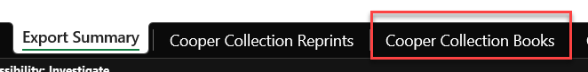
5. Take a minute to look through the different columns to understand what kind of data they contain.
6. One way to explore the data is through filtering. Select all the data in the sheet, then in Home > Editing > Sort & Filter, click "Filter."  
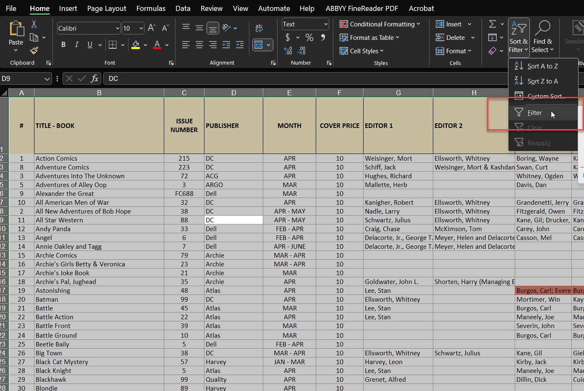
8. This puts little drop-down triangle icons in the bottom right corner of each column header. If you click on it, a dropdown menu appears  
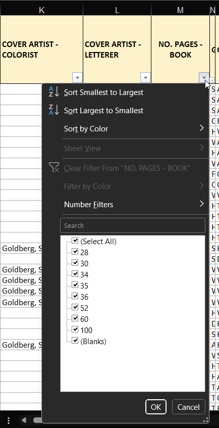
10. On the menu, you can select, deselect, and search for different data. If we click the filter for Column M (No. Pages - Book), we see there are 8 choices for the number of pages in a comic book.
11. We could only want to see those books with 36 pages, and so we deselect all by unclicking "Select All" and then re-selecting "36" or type "36" in the search bar and hit enter. Now we only see those books with 36 pages. (See gif)
13. To get rid of the filter, we can click on the dropdown arrow again and hit "Clear Filter" or re-select "Select All" at the top. (See gif)  

15. Filtering also allows you to sort your data. With Column M (No. Pages - Book), we can sort "smallest to largest" or "largest to smallest" since they are numbers. Text columns can be sorted A-Z to Z-A.  
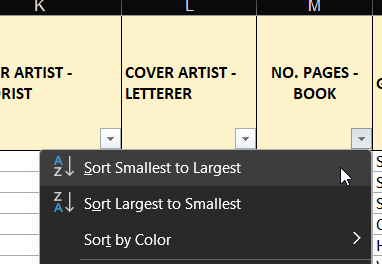

## Pivot tables
But how many comic books have 36 pages compared to those with a 100 pages? We could count sort smallest to largest and then count how many of each in the column. Or we could make the computer do it for us. That's what pivot tables are for!
1. Select all of the data in the "Cooper Collection Books" sheet.
2. Then go to Insert tab > Tables > PivotTable > From Data/Range  
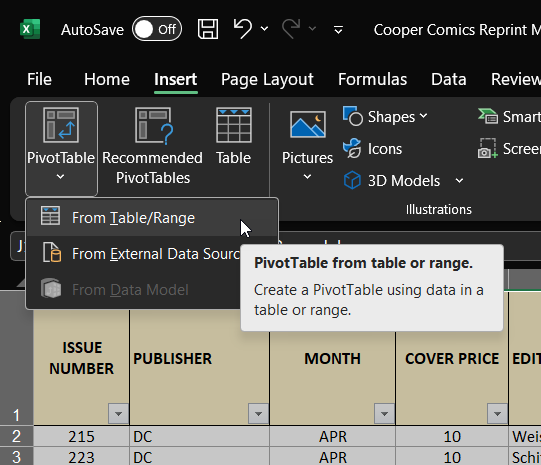
4. A pop-up window will come up and ask you to select the Table/Range to act as the data source for your pivot table and whether you want to create the PivotTable in a new worksheet or an existing one. Since we selected the whole Books sheet first, it will have automatically filled in the range and auto-selected "New Worksheet." So there's no need to change anything and just hit "OK."  
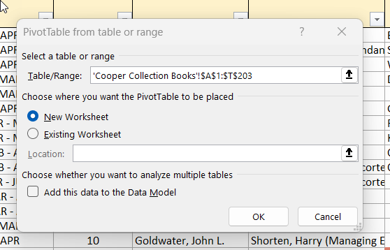
6. Excel will create a new sheet for you with the PivotTable and its settings.  
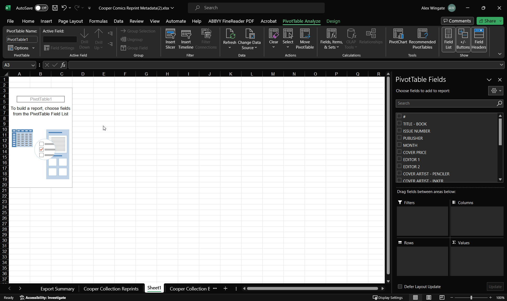
8. On the right side, you'll see a list of fields that correspond to the column names in the Books sheet and then four areas called "Filters," "Columns," "Rows," and "Values."
10. From the field list, scroll to "No. Pages - Book." Click and drag it to the "Rows" area. Now there's a list of the unique values for the number of pages in the cell area.  
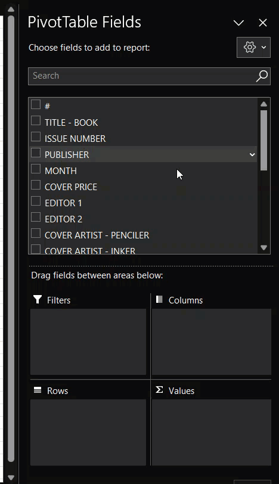
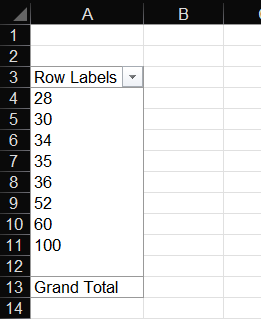
12. Next, drag the first field in the sidebar "#" to the "Values" area. (See gif)
13. Because these are numbers, Excel thinks it should add them up. Click on "Sum of #" and when a menu appears, click "Value Field Settings." Here we want to choose "Count" because we want the count of the IDs (one ID = 1 book) to get the count of books that have that number of pages. (See gif)  

15. Now we see that 36 page books are by far the most common, followed by 34 page books. 1 book also doesn't have a page count.  
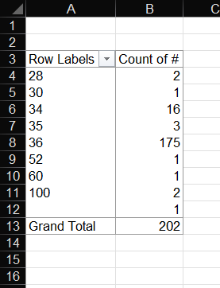
16. We can also introduce another variable using the columns. For example, are certain publishers associated with certain lengths of book? Drag and drop "Publisher" into columns. Now the pivot table shows in each cell the number of books each publisher published of that particular length.  
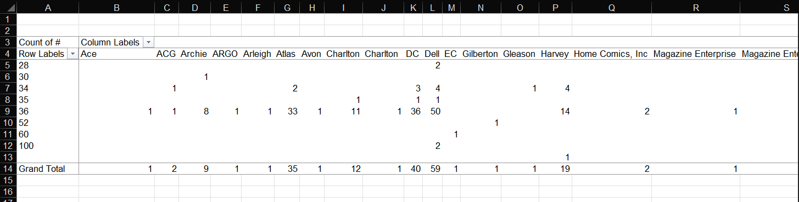
18. Given that there are more publishers than different types of page counts, drag the "Publisher" field into the "Rows" area and "No. Page Count" into the "Columns" area. Now we can more easily see the data. We can also see who the more productive publishers were and the total number of each page count through the Grand Total row and column. Their intersection gives the total number of book records in the data (202).  
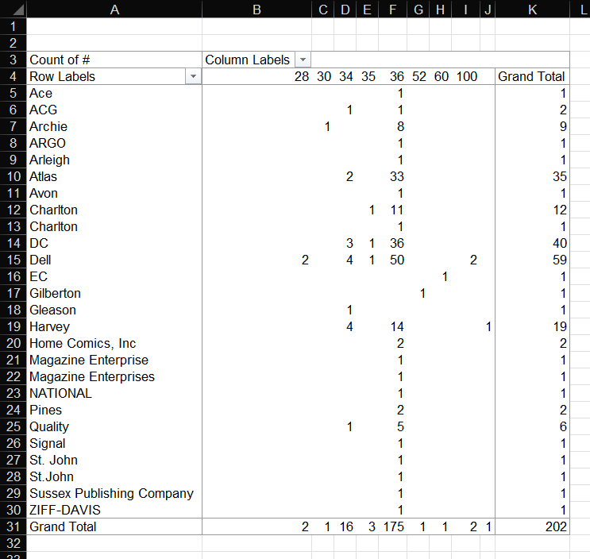
20. The last area, "Filters," works like the filters on the normal spreadsheet. It lets us control what data is shown in the PivotTable. Let's say we're only interested in specific primary genres. Drag "Genre 1 - Book" to the "Filters" area. 
21. This adds content into the first row of the sheet. Click the dropdown next to "All." Click "Funny Animal." Now only the data for Funny Animal comics is shown.  
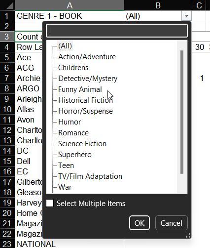
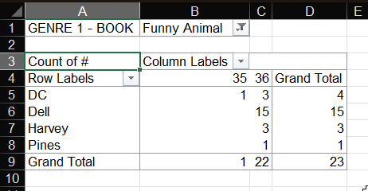
23. You can also filter the rows and columns values without adding them as an additional filter. Use the dropdowns next to "Row Labels" and "Column Labels."  
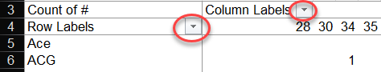

## Visualizations
Using the data aggregated from the PivotTable, we can start do some visualizations of our data. 
1. Modify the Pivot Table so that the number of pages in a book is displayed in the rows and the count of books is the values of the pivot table.  
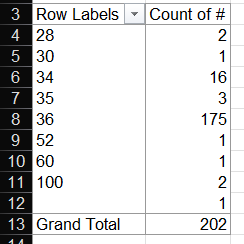  
3. Select the values in the table, and copy and paste them into a new sheet.  
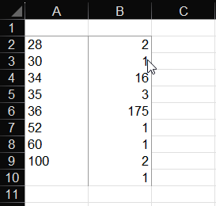  
5. Add column headings and "unknown" for the row where there's no value for the page count.  
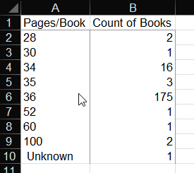  
7. This is the data we're going to visualize. What types of charts make sense?
    - Pie charts are bad for comparison. Humans aren't good at judging ratios of angles.
    - It's not time-based data, so line graphs don't make sense either.
    - Bar chart or something similar best bet here.
5. Select all your data and then go to the Insert tab > Charts and then choose one of the bar or column charts.  
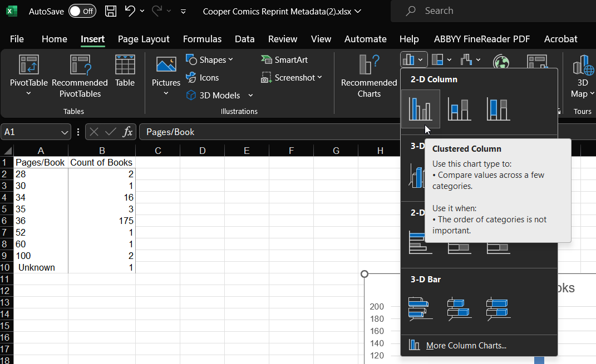
6. Now you have a graph. When the graph is selected, Excel provides a "Chart Design" tab and "Format" tab for modifying your graph.  
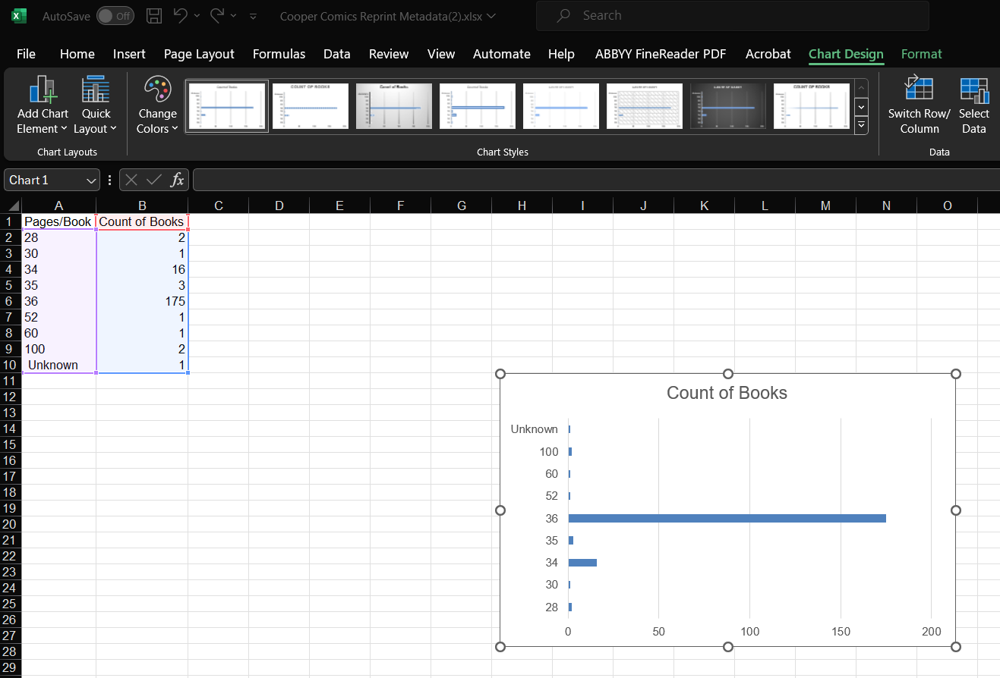
7. In "Chart Design" go to Add Chart Element > Axis Titles > Primary Horizontal. This inserts a text box for the x-axis. Add a descriptive title for what the x-axis represents. Repeat for the y-axis, selecting "Primary Vertical" instead.  
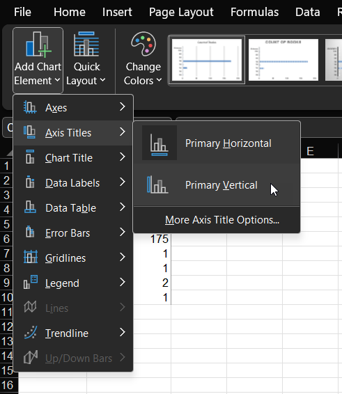
8. You can also edit the chart title by double clicking on the title in the chart.  
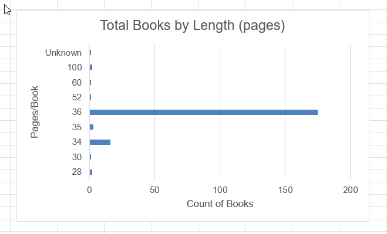
9. Selecting other elements of the chart will bring up a right sidebar with formatting options. For example, we can change the major units of the x-axis to 25 instead of 50 which means the x-axis counts by 25 instead of 50. You can also format the colors, font, and other aspects of the text using the font options in the Home tab as you would for normal text.  
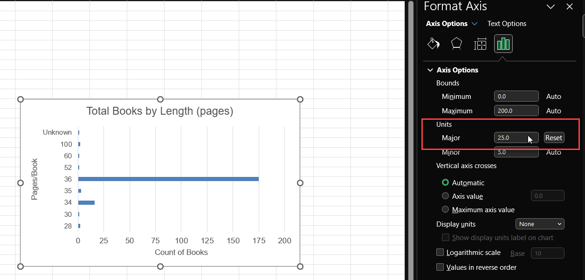
10. Explore the different elements and options in the Format sidebar to see what else you can change.  
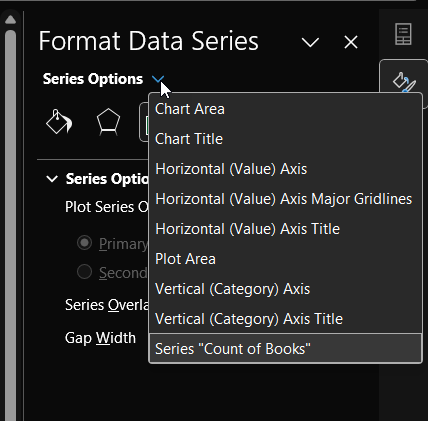

