# Excel visualization walk-through

*This walk-through demonstrates one example using the **Cooper Collection Books** sheet and page counts. For the lab, you may use this same approach with a different sheet, field, or question.*

## Dataset
Download the dataset here:  
[Cooper Comics Collection data](https://mikrowelle.github.io/cooper-comics-final/data/Cooper%20Comics%20Reprint%20Metadata.xlsx)

We will work in the **Cooper Collection Books** sheet.

## 1. Filter the data

1. Open the file in Excel.  
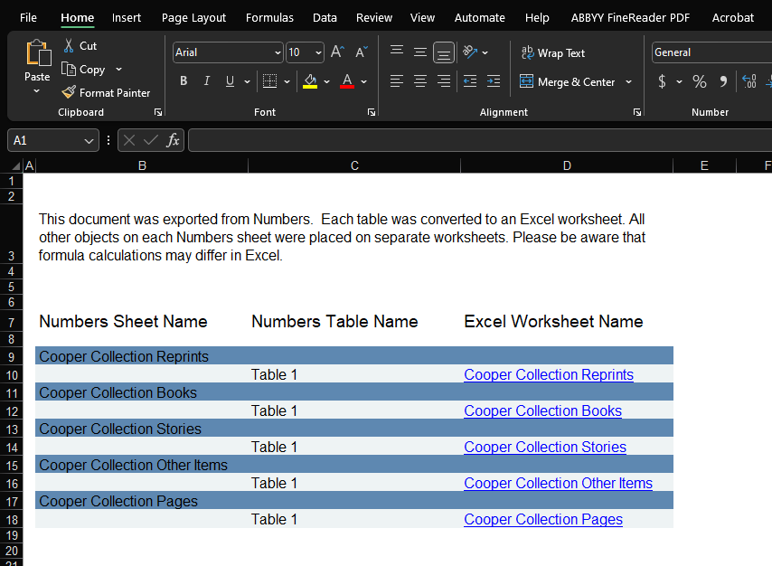

2. Click the **Cooper Collection Books** sheet.  
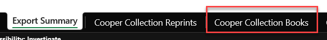

3. Select the data in the sheet.

4. Go to **Home > Sort & Filter > Filter**.  
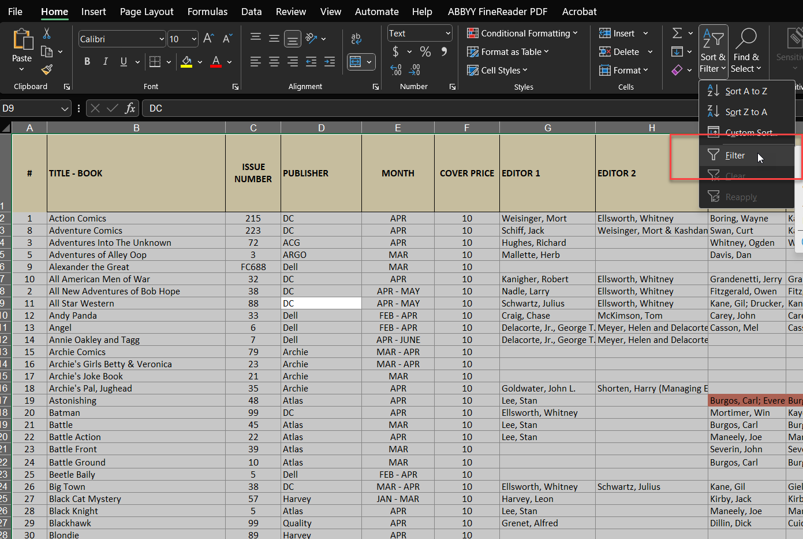

5. Excel adds a dropdown arrow to each column header.

6. Click a dropdown arrow to filter or sort that column.  
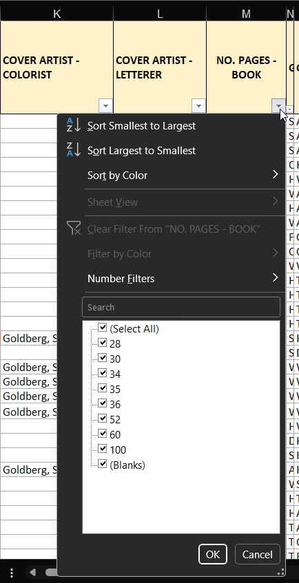

For example, to show only books with **36 pages**:

1. Open the filter for **No. Pages - Book**.
2. Clear **Select All**.
3. Select **36**.
4. Click **OK**.  

To remove the filter, open the same menu and choose **Clear Filter**, or reselect **Select All**.

You can also use these dropdown menus to sort values:
- number columns: **Smallest to Largest** or **Largest to Smallest**
- text columns: **A to Z** or **Z to A**  
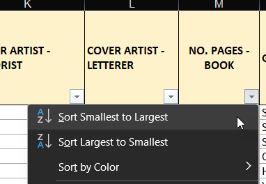

<!-- Instructor note: The goal here is just to show students how to inspect and narrow the data before summarizing it. -->

## 2. Create a pivot table

1. Select the data in **Cooper Collection Books**.

2. Go to **Insert > PivotTable**.  
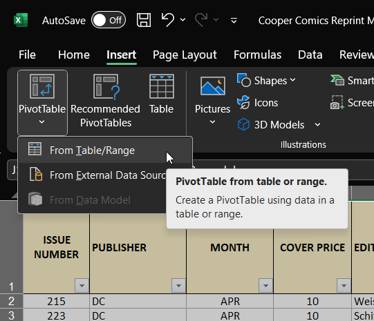

3. In the dialog box, keep the selected range.

4. Leave **New Worksheet** selected.

5. Click **OK**.  
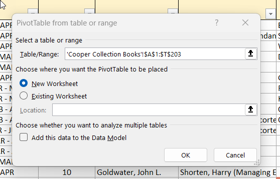

Excel creates a new worksheet with an empty pivot table and a **PivotTable Fields** panel.  
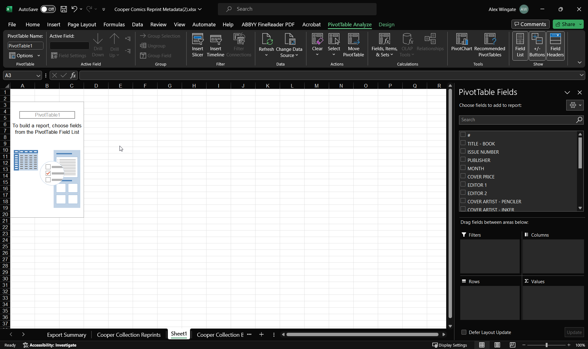

## 3. Count books by page length

1. In the field list, drag **No. Pages - Book** to **Rows**.  
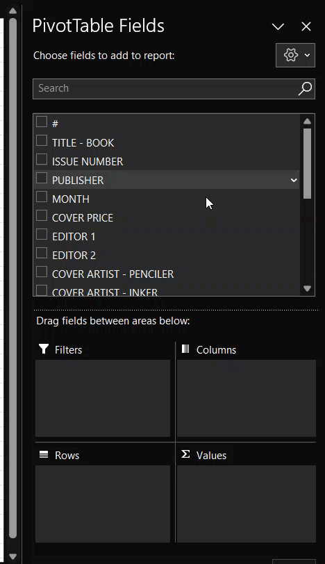  
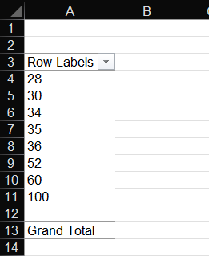

2. Drag **#** to **Values**.  

Excel may set this to **Sum of #**. Change it to a count:

3. In the Values area, click **Sum of #**.
4. Choose **Value Field Settings**.
5. Select **Count**.
6. Click **OK**.

You should now see the number of books for each page length.  
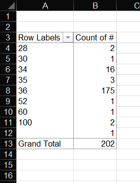

<!-- Instructor note: This is the main conceptual move. Students are aggregating the data instead of reading row by row. -->

## 4. Compare with another variable

To compare page length with publisher:

1. Drag **Publisher** to **Columns**.

This shows the count of books for each combination of **page count** and **publisher**.  
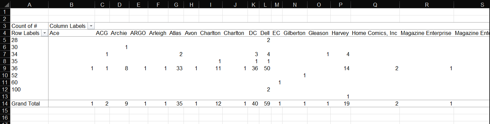

If that view is hard to read:

2. Move **Publisher** to **Rows**.
3. Move **No. Pages - Book** to **Columns**.  
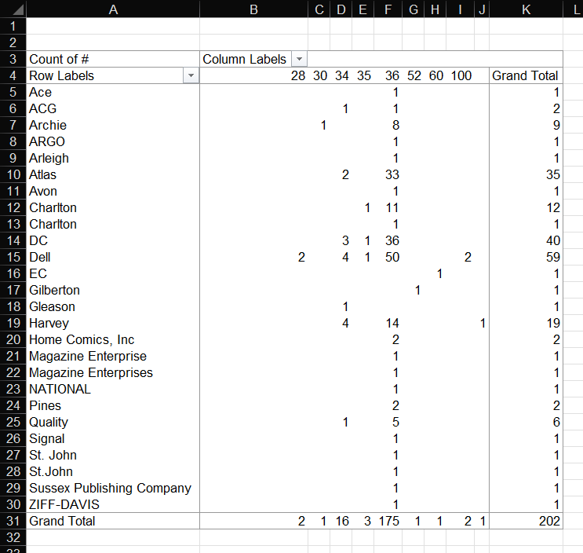

You can also filter the pivot table itself:

1. Drag **Genre 1 - Book** to **Filters**.
2. Use the filter above the table to choose a genre such as **Funny Animal**.  
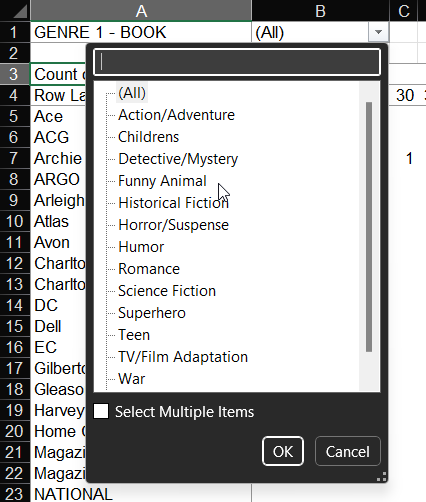  
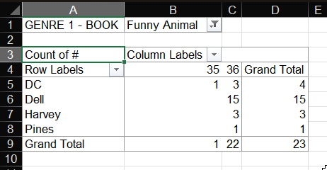

You can also filter values already in the table using the dropdowns next to **Row Labels** and **Column Labels**.  
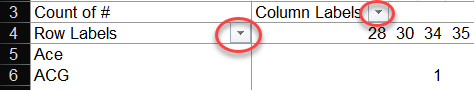

## 5. Make a chart

Set up the pivot table so that:
- **No. Pages - Book** is in **Rows**
- **Count of #** is in **Values**  
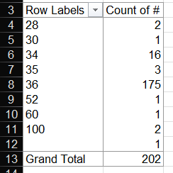

Then:

1. Copy the page-count and count values from the pivot table.
2. Paste them into a new worksheet.  
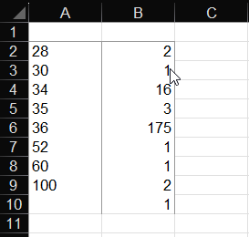

3. Add clear column headings.
4. If one row has no page-count value, label it **Unknown**.  
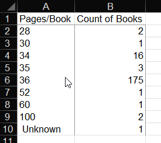

A bar or column chart works well here because you are comparing category counts.

1. Select the copied data.
2. Go to **Insert > Charts**.
3. Choose a **bar chart** or **column chart**.  
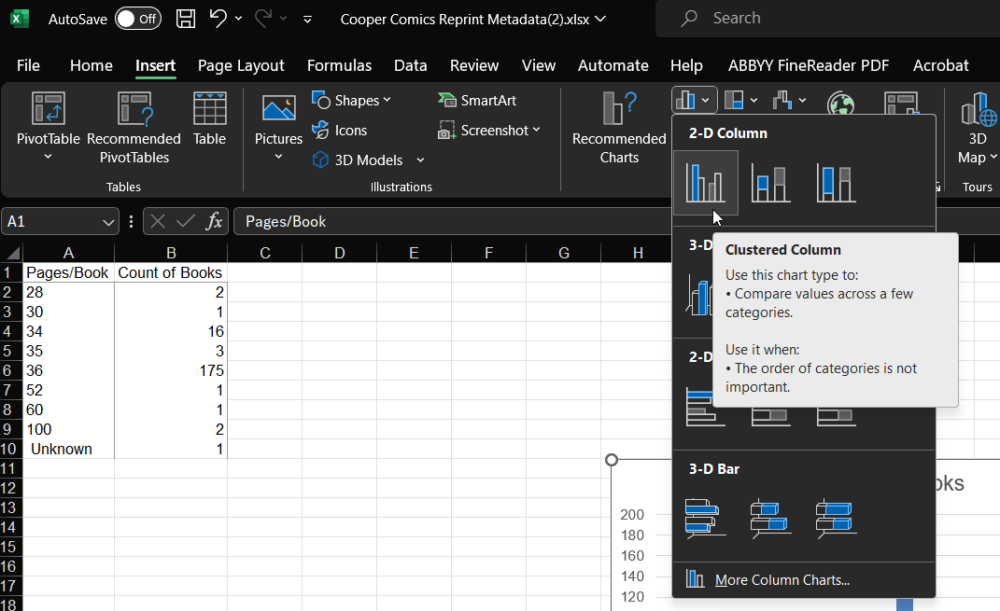

Excel inserts the chart into the worksheet.  
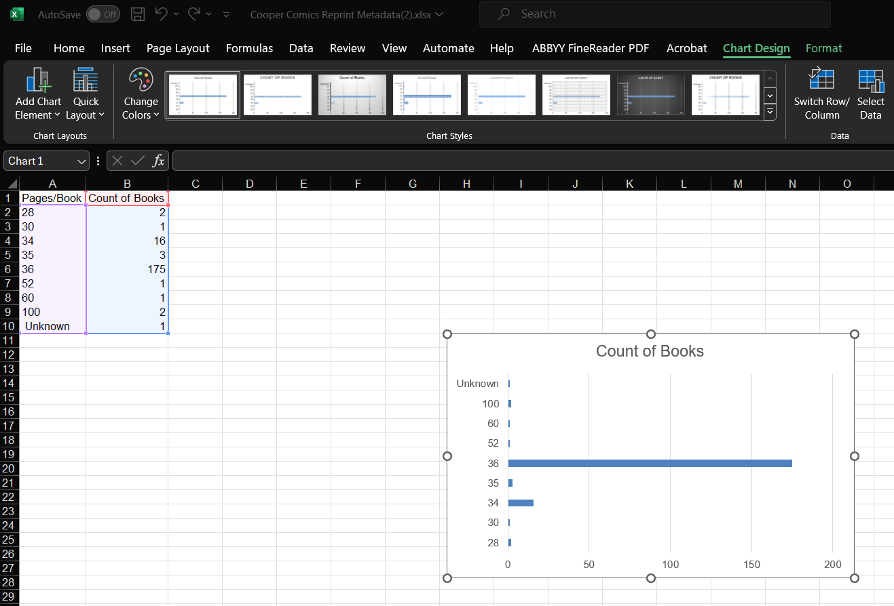

## 6. Improve readability

With the chart selected:

1. Edit the chart title.
2. Add axis titles using **Chart Design > Add Chart Element > Axis Titles**.  
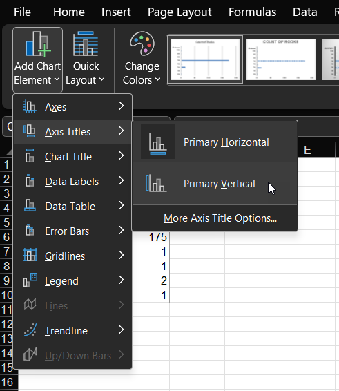

3. Double-click the chart title to change it.  
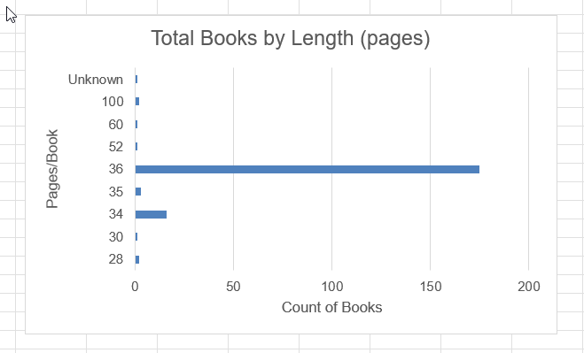

4. Check that the labels are readable.
5. Adjust axis settings, spacing, or font size if needed.  
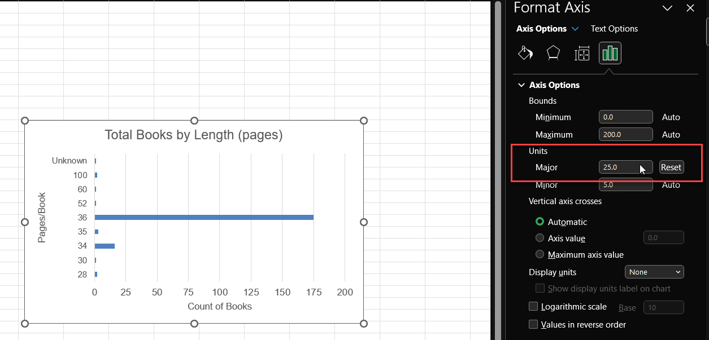

You can also use the formatting sidebar to adjust other chart elements.  
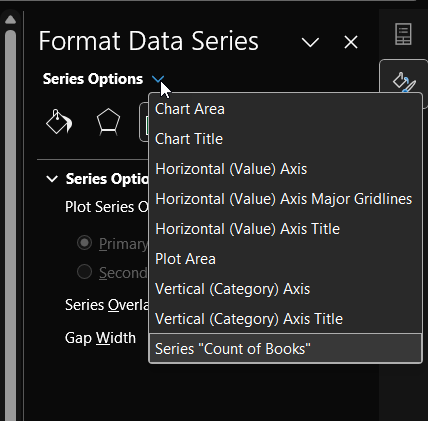

<!-- Instructor note: Do not let students get stuck polishing. Clear title, readable labels, and a sensible chart type are enough. -->

## 7. What you should have

By the end of this exercise, you should have:
- one filtered view of the data
- one pivot table
- one chart based on that pivot table
