# NVivo Walkthrough
1. Download your corpus to your computer
3. Create new project in NVivo; fill out information for project  

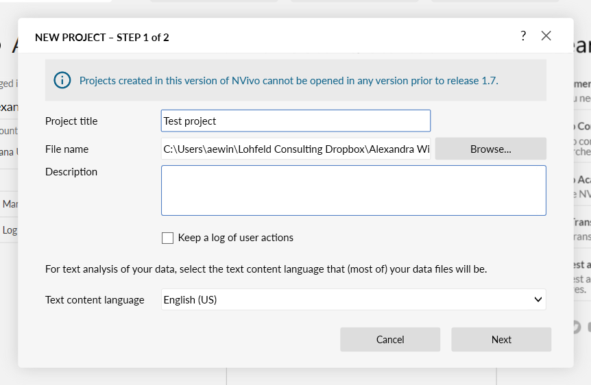  
5. Import > Files  
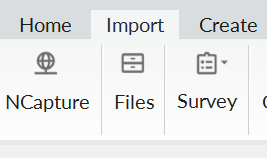  
7. Double click on file to open it
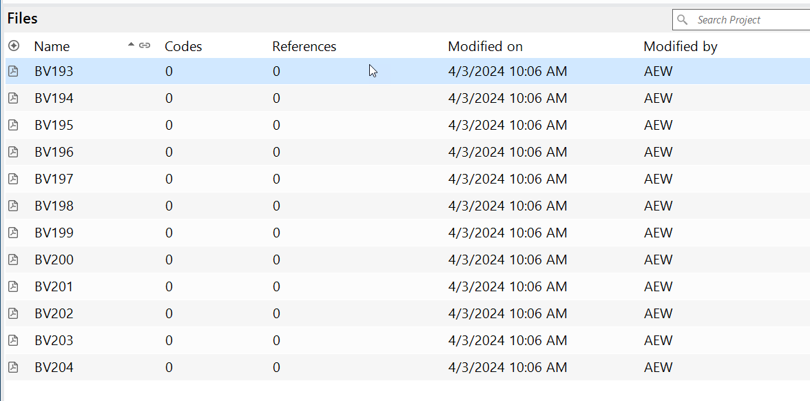  
9. Creating codes
	- If you have an existing codebook, or have an idea of your codes, you can create them at the beginning
	- You might also decide to code a test corpus to see what codes come up
	- To create a code on the spot while in the document
		- Create > Code  
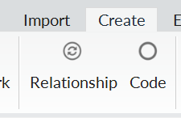  
			- Give name and description  
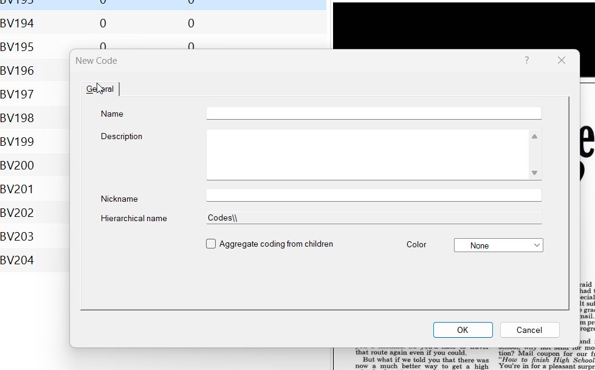  
10. Applying codes
	- You have to select something to code
		- Can select text if text is selectable (e.g. text file, Word doc)
		- Region if text not selectable  
  
	- Click "code" (or Ctrl + F2) and select the code  
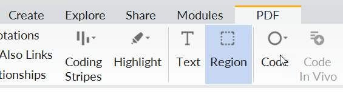  
		- Or right click on selected region  
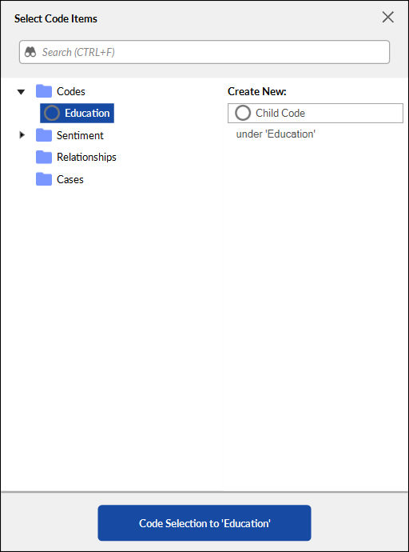  
	- Can also select region to code, and create new code then
	- Can code to more than one code at once (hold down Control)
	- Hovering on "Code" also shows recent codes
	- Want to decide what counts as "one" code
11. Can check distribution of codes across files and references by clicking "Codes" under "Coding" in left sidebar
  
13. Can see all files by clicking "Files" under "data"
14. Visualizing
	- Explore → lots of different options
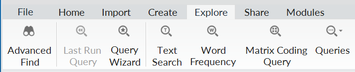  
	- Matrix is a good basic option  
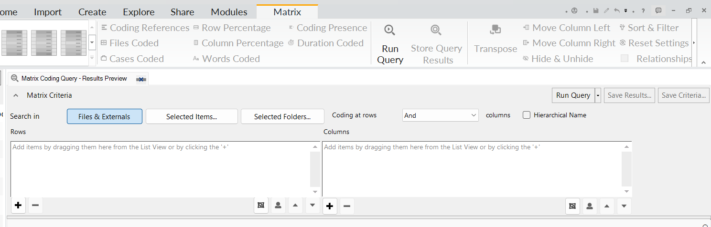  
		- Select Rows and columns  
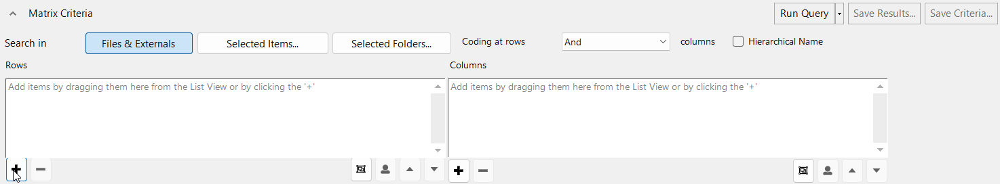  
			- Files and codes
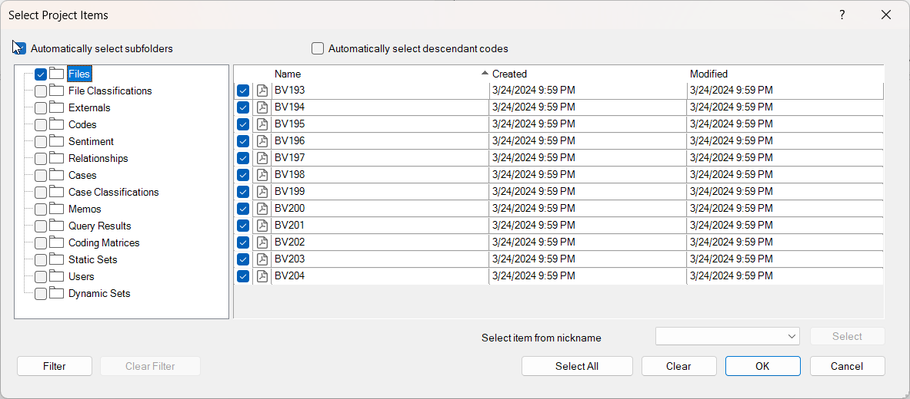
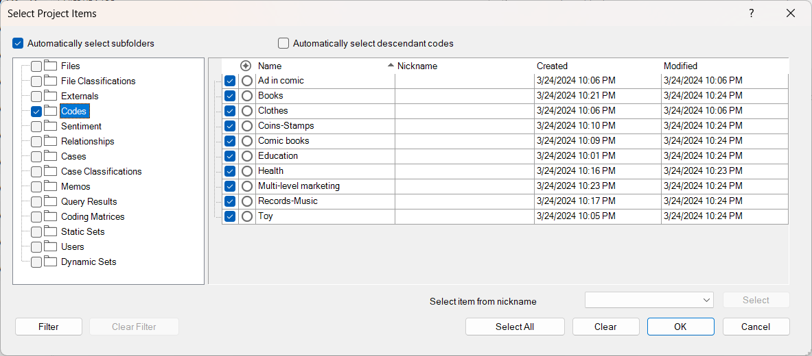  
		- Then Run Query
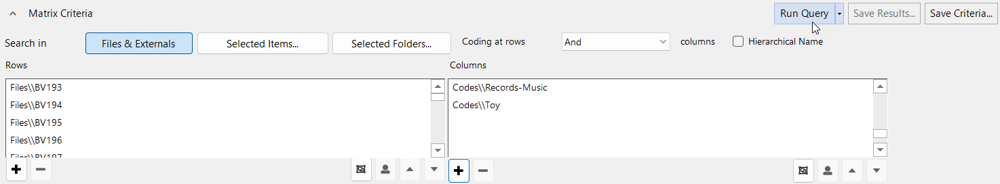
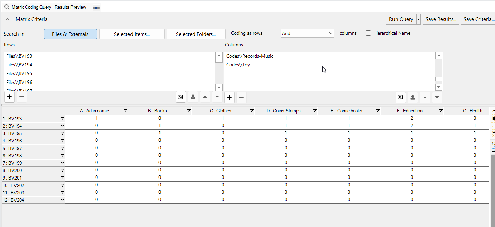  
		- Can use color selection at top to highlight high and low values.  
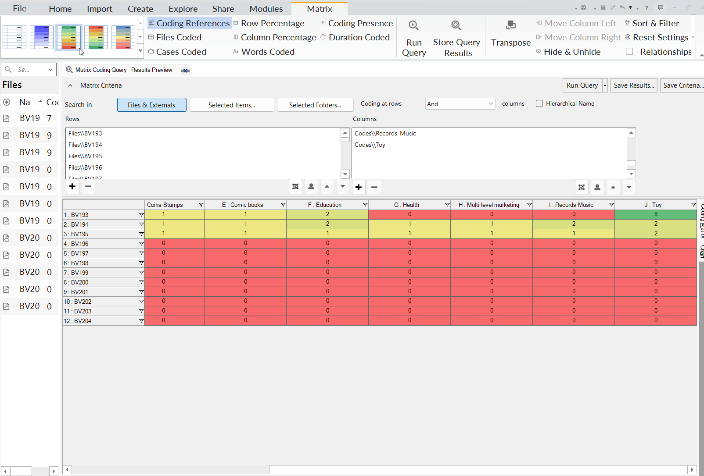  
	3. How to export out?
		- click box in upper left corner of table to select all cells
		- Then copy and paste into Excel or other spreadsheet program
