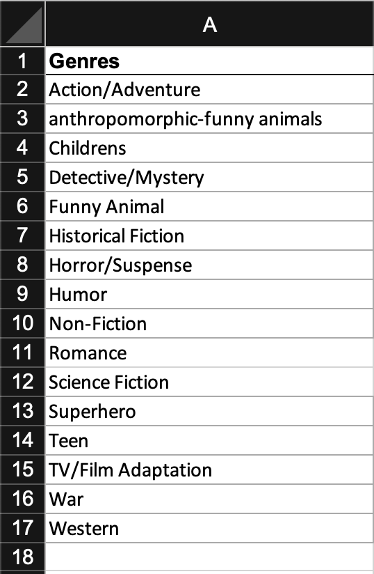

# Week 9: Data visualization lab

## Summary
This week we will gain hands-on experience with some data visualization tools and create visualizations from comics-related data sets.

## Weekly Learning Objectives

- _create_ data visualizations in Excel.
- _create_ data visualizations in Tableau.
- _create_ data visualizations in Flourish.
 
## Before class: Readings, resources, and tasks
- Install Microsoft Excel (see <https://iuware.iu.edu/>).
- Create a [Flourish](https://flourish.studio/) account.
- Create a [Tableau](https://www.tableau.com/academic/students) account.
 
## In class

### Counting genres

#### Dataset

*   [Spreadsheet of data](https://mikrowelle.github.io/cooper-comics-final/data/Cooper%20Comics%20Reprint%20Metadata.xlsx) from the [The Stephen Cooper Comic Book Collection](https://cary-exhibits.rit.edu/exhibits/show/cooper-comics).

#### Tool: Microsoft Excel

1.  Open Excel [file](https://mikrowelle.github.io/cooper-comics-final/data/Cooper%20Comics%20Reprint%20Metadata.xlsx).
2.  Create a new sheet and name the new sheet `Counting`.
3.  Get genres from the `Cooper Collections Stories` sheet
    *   Excel option
        *   copy and paste `GENRE - STORY` column from `Cooper Collections Stories` sheet to `Counting` sheet
        *   Select `GENRE - STORY` column in `Counting` sheet and run `Remove Duplicates` function.
    *   Atom option
        *   select and copy the `GENRE - STORY` column
        *   paste into a text editor (e.g., Atom)
        *   Select All with `Cmd-A` (MacOS) or `Ctrl-A` (Windows)
        *   Install `sort-lines` package in atom
            *   From within Atom: `Settings -> Install` -\> search for “sort-lines” and click “Install”
            *   Type `Cmd-Shift-P` (MacOS) or `Ctrl-Shift-P` (Windows); then type `sort`; then select the `Sort Lines: Unique`command.
4.  In new sheet create a column “genres” with one row for each genre:   
  
_Fig. 1. Genre column._
5.  Count the genres
    *   In `Counting` sheet, next to the `genres` column, create a `count` column
    *   In the first cell of the `count` column, enter the formula `=COUNTIF('Cooper Collection Stories'!M:M,Counting!A2)`
    *   copy and paste this formula in the other rows
6.  Add percentages
    *   In `Counting` sheet, next to the `count` column, create a `percentage` column
    *   In the first cell of the `percentage` column, enter the formula `=B2/SUM($B$2:$B$17)`
    *   copy and paste this formula in the other rows
    *   select the row and change the format to `Percentage`
7.  Insert chart from the `Insert` toolbar.

### Mapping Publishers

#### Dataset

*   Michigan State University [comics-as-data](https://github.com/ktopham/comics-as-data).
    *   [https://github.com/ktopham/comics-as-data/raw/master/comics\_as\_data\_north\_america\_2020-01-20\_reconciled\_full.csvLinks to an external site.](https://github.com/ktopham/comics-as-data/raw/master/comics_as_data_north_america_2020-01-20_reconciled_full.csv)

#### Tool: [Flourish](https://flourish.studio/).

1.  Login to your [Flourish](https://flourish.studio/) account.
2.  Select `New Visualization`
3.  Under `Projection map`, select the `US (states)` option.
4.  Select the `Data` tab.
5.  Select the `Points` tab.
6.  Select `Upload data` to upload the `comics_as_data_north_america_2020-01-20_reconciled_full.csv` file.
7.  Enter the appropriate columns for `Name`, `Longitude`, and `Latitude`.
8.  Preview your visualization.